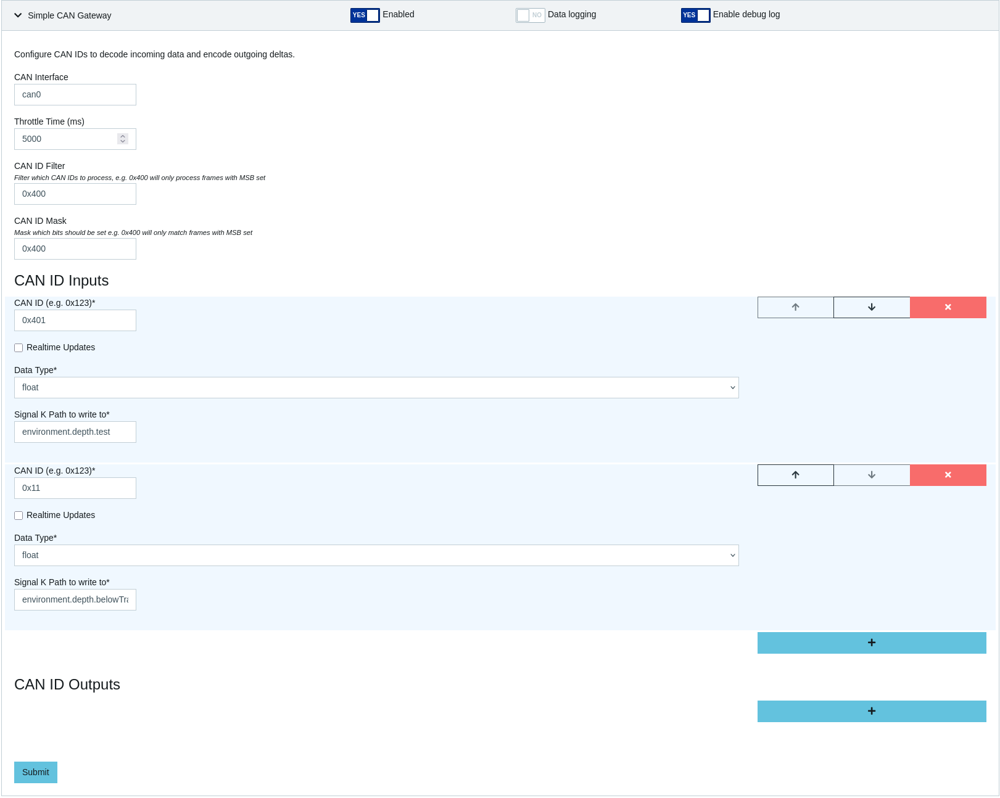

# signalk-simple-can-gw
This plugin can relay between a simple CAN protocol and deltas in both directions.
One CAN ID can hold one value e.g. uint, int, float which than gets mapped to a data field.

Same can be done the other way around.

To not overwhelm the server, filters can be set. On my bus for example all telemetric data has the CAN-ID MSB set so I filter everything else out with id = 0x400 and mask 0x400.

To throttle the ingestion further the realtime flag can be ticked off so the throttle time will apply.

# Configuration
